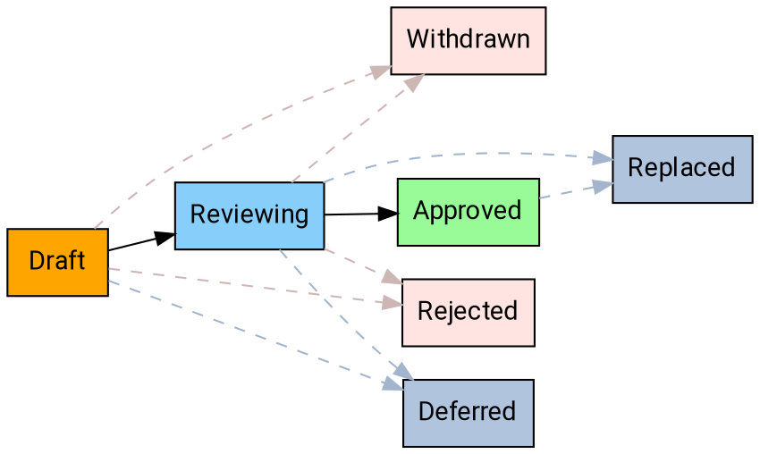

# AIP Purpose and Guidelines

As Thryv's API ecosystem grows, we need consistent documentation and design patterns to ensure our APIs are intuitive,
reliable, and easy to use. AIPs provide a standardized way to document and share API design decisions across Thryv.

## What is an AIP?

AIP stands for **API Improvement Proposal**, a design document providing concise, actionable guidance for API
development. AIPs serve as our source of truth for API design standards and help teams make consistent decisions across
all Thryv products. AIPs are maintained as Markdown files in the [AIP GitHub repository][].

## Types of AIPs

There are several different types of AIPs, described below. The list of AIP
types may evolve over time as necessary.

### Guidance

These AIPs describe guidance on API design. These are provided as instruction
for API producers to help write simple, intuitive, and consistent APIs and are
used by API reviewers as a basis for review comments.

### Process

These AIPs describe a process surrounding API design. They often affect the AIP
process itself and are used to enhance the way in which AIPs are handled.

## Stakeholders

### Editors

The AIP editors are responsible for:

* Reviewing and approving AIPs
* Maintaining AIP quality and consistency
* Managing the AIP workflow and numbering
* Ensuring AIPs are clear, actionable, and well-written

Current editors are the members of the [Gryffindor team][].

## Domain-specific AIPs

Some AIPs may be specific to a particular domain (for example, only to APIs
within a certain PA, or even a certain team). In this situation, the group will
be given a particular block of AIPs to use in accordance with AIP-2, and the
applicable AIPs will clearly indicate their scope.

## States

At any given time, AIPs may exist in a variety of states as they work their way
through the process. The following is a summary of each state.

### Draft

The initial state for an AIP is the "Draft" state. This means that the AIP is
being discussed and iterated upon.

### Reviewing

The AIP has a solid proposal and is under formal review by the AIP maintainers.
Changes may still be requested before approval.

### Approved

The AIP is approved and represents Thryv's current best practice.
This is the state you should follow for API design.

### Withdrawn

If an AIP is withdrawn by the author or champion, it enters "withdrawn" state.
AIPs that are withdrawn may be taken up by another champion.

### Rejected

If an AIP is rejected by the AIP editors, it enters "rejected" state. AIPs that
are rejected remain and provide documentation and reference to inform future
discussions.

### Deferred

If an AIP has not been acted upon for a significant period of time, the editors
may mark it as "deferred".

### Replaced

The AIP has been superseded by a newer AIP with updated guidance.

## Workflow

The following workflow describes the process for proposing an AIP and moving
an AIP from proposal to implementation to final acceptance.

### Overview

### Proposing an AIP

Anyone at Thryv can propose a AIP!

In order to propose an AIP, first [open an issue][] to circulate the
fundamental idea for initial feedback. It should generally be possible to
describe the idea in a couple of pages.

When proposing a new AIP or changes to an existing one, it is best to reference
prior art and/or example use cases that the proposal will impact, so as to
ensure that the proposal is grounded in a realistic problem space. So, proposals
**should** provide concrete references and/or well-defined examples. Appropriate
material includes, but is not limited to, the following:

- Existing external RFCs or standards
- A corpus of APIs that have aligned on a similar pattern e.g. `Search` methods
- A concrete use case that has yet to be solved that exists or could exist in
  one or more APIs e.g., adding an AIP-202 Format for AIP-143 Unicode CLDR
  region codes

Once ready, create a PR with a new file in the AIP directory using a file
titled `aip/new.md`. Ensure that the PR is editable by maintainers.

In most circumstances, the editors will assign the proposal an AIP number and
submit the PR with the AIP in the "Reviewing" state. The editors may reject an
AIP outright if they have an obvious reason to do so (e.g., the proposal was
already discussed and rejected in another AIP or is fundamentally unsound), in
which case the PR is not merged.

### Discussing an AIP

Once the PR is merged, the AIP author is responsible for championing the AIP on
a follow-up approval pull request. This means that the author is responsible
for pushing towards consensus around the proposal. This may involve a
discussion at the regularly scheduled meetings for the API Governance team.

The AIP author may modify the AIP over the course of discussion by submitting
follow-up commits to the PR.

### Accepting an AIP

The editors will work together to ensure that qualified proposals do not linger
in review.

To gain final approval, an AIP **must** be approved by, at minimum, the TL with
responsibility over the domain covered by the AIP (either design or
infrastructure) and at least one other editor, with no editors actively
requesting changes.

**Note:** If an AIP editor is the primary author of an AIP, then at least two
_other_ editors must approve it.

Once the AIP is approved, the editors will update the state of the AIP to
reflect this and submit the PR.

### Withdrawing or Rejecting an AIP

The author of an AIP may decide, after further consideration, that an AIP
should not advance. If so, the author may withdraw the AIP by updating the PR
adding a notice of withdrawal with an explanation of the rationale.
Additionally, the author may be unable to get consensus among the group and the
AIP editors may elect to reject the AIP. In this situation, the AIP editors
shall amend the PR adding a notice of rejection with an explanation of the
rationale. In both cases, the AIP editors update the state accordingly and
submit the PR.

### Replacing an AIP

In rare cases, it may be necessary to replace an AIP with another one. This is
not general practice: minor edits to approved AIPs are acceptable and will be
the common way to tweak guidance. However, if new guidance fundamentally alters
the old guidance in some way, then the AIP editors shall create a new AIP that,
once approved, will replace the old one. The old one then enters "Replaced"
state, and will link to the new, current AIP.

## Questions?

* Slack: [#ask-pd-api][]
* Repository: [GitHub Issues][]

## Changelog

- **2025-10-20**: Initial AIP-1 for Thryv, adapted from Google AIP-1.

[aip github repository]: https://github.com/infusionsoft/thryv.aip.dev

[Gryffindor team]: https://github.com/orgs/infusionsoft/teams/gryffindor

[open an issue]: https://github.com/infusionsoft/thryv.aip.dev/issues

[#ask-pd-api]: https://keaporg.enterprise.slack.com/archives/C5HG5M4FP

[GitHub Issues]: https://github.com/infusionsoft/thryv.aip.dev/issues
